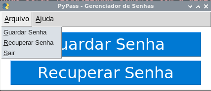

# PyPass Gerenciador de Senhas

## O que é e para que serve o PyPass Gerenciador de Senhas?
O **PyPass Gerenciador de Senhas** é um gerenciador de senhas feito inteiramente em Python e com interface gráfica gerada pela biblioteca [PySimpleGui](https://pypi.org/project/PySimpleGUI/). As senhas são salvas no computador em arquivos individuais com a extenção **.aes** e criptografados e descriptografados somente mediante uma **Senha Mestra** que deve ser uma senha segura e ao mesmo tempo de fácil memorização.  
## Como instalar o PyPass Gerenciador de Senhas?
Para ter o **PyPass Gerenciador de Senhas** você pode clonar o repositório com o comando:
~~~shell
git clone https://github.com/elizeubarbosaabreu/PyPass-Gerenciador-de-Senhas.git
~~~
Em seguida entre dentro da pasta com o comando e crie uma máquina virtual: 
~~~python
cd PyPass-Gerenciador-de-Senhas
python3 -m venv .venv
source .venv/bin/activate
~~~

Se você estiver usando o Windows vai usar:
~~~python
cd PyPass-Gerenciador-de-Senhas
python -m venv .venv
source .venv\bin\activate.bat
~~~

Após criar e ativar a máquina virtual instale os requerimentos:
~~~shell
pip install -r requirements.txt
~~~
Pronto agora só rodar o PyPass Gerenciador de Senhas
~~~shell
python app.py
~~~
## Dicas:
* Use o **pyinstaller** para converter o arquivo app.py em executável. [Site do pyinstaller](http://www.pyinstaller.org/).
* Compartilhe o conhecimento!!!

